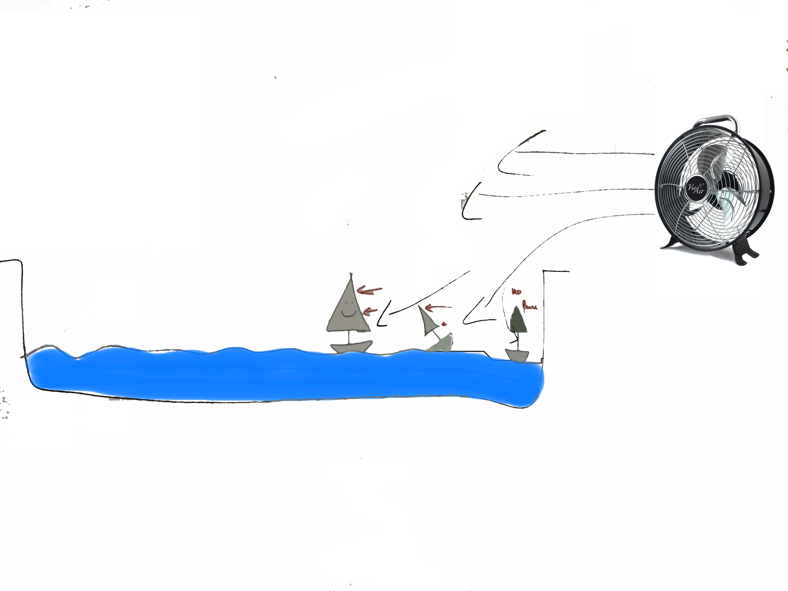

Last Saturday we took part in the University Science Day. After the towing tank tour we had activities for children and grown ups.
During the day around 800 visitors passed through the towing tank and asked us some very interesting questions!
After collecting all the questions we got, we decided they had three main themes and we would thus write three posts about them:
  * Wind conditions while testing
  * Comparison of visitor`s sailing experience and robot sailing
  * Is sailing the past - or the future?

Today we will start with part one: Wind conditions while testing.

Hundreds of children designed sail shapes and painted them, they picked one of our foam boats and then tested it in a small pool we brought, using the wind supplied by a fan.
Doing so, they spotted a couple of things:
  * If a race between boats was started at the wall of the pool, the boats didn`t move at all!
  * If a race was started ca. 5 cm from the pool wall, boats with rectangular sails tipped over the bow (the front of their boat), whilst boats with triangular sails were ok.
  * All boats were sailing downwind well when started about 10 cm from the wall.

In our meeting today, we drew on the whiteboard to explain what happened:

For safety reasons, we only put the minimum amount of water in the pool that allowed the boats to float nicely.
This meant that a high wall was standing inbetween the wind coming from the ventilator and the water surface.
The area where no boats started simply didn`t get a lot of the wind produced by the fan.
At about 10 cm distance, the wind was nearly parallel to the surface.
Now the bit in between is where it gets interesting!

Let`s first look at the normal condition, with the wind going approximately parallel to the wind:
Normally, with parallel wind, the largest force is generated when the sail is at a right angle to the wind.
This means the largest area of the sail is seen by the wind when the boat is upright. Therefore the largest
force is generated when the boat is upright (see 1 in the drawing below). The forces along the mast create a moment as well,
that will try to push the bow down. There are two influences on this moment: How far up the mast are we, and how wide is the sail in this area.
The further we get up the mast, the larger the created moment gets. If the sail is wider in an area, a larger force is generated, and thus the moment from this area is larger.
Our small boats were designed so the moment could not get strong enough to tip them over if the wind is coming parallel.
And even if the boat tips over, there is a nice safety mechanism: Because the sail is then not at a 90 degree angle to the wind, the area the wind sees is smaller.
This means the force created by the wind is smaller! And as a result, the moment is smaller, so the boat will not tip over and come back to an upright position.

Now to the area we are interested in: In the area where boats with rectangular sails fell over, the wind was at an angle to the water surface, pushing towards the water surface.
While the boat is upright, the force created by the wind is actually smaller: The wind is coming at an angle to the sail, and so the wind sees a smaller surface area.
This changes if the boat starts tipping over, for example because of a small wave. Then the sail gets better aligned with the wind direction,
the wind sees a larger area, and the moment increases, tipping the boat even further, until it capsizes (see figures 3 and 4 in the drawing below).
But why did the rectangular sails cause more problems than the triangular ones? Well, we mentioned earlier, the wider the sail is in an area, the stronger the moment.
The further up the mast, the stronger the moment.
Rectangular sails are very wide at the top of the mast, triangular sails are not wide at the top of the mast. As a result, boats with rectangular sails got a stronger moment that
was trying to tip them over. This is why more of them capsized.

Whilst the kids where happily capsizing boats in the small pool, some adults were thinking back to the towing tank tour they had just finished and asked us,
if we were doing any testing in there. Sadly we had to disappoint them: Currently there is no large scale version of the ventilator, so we cannot generate wind
in the towing tank. But we discussed this idea with some other people who are working with the towing tank, and we heard something exciting: We are apparently not the only
ones interested in this! It is of course still far in the future, but who knows, maybe some day soon we can test our boat and its ability to tack upwind in various wave
conditions - wouldn't that be very exciting?!
